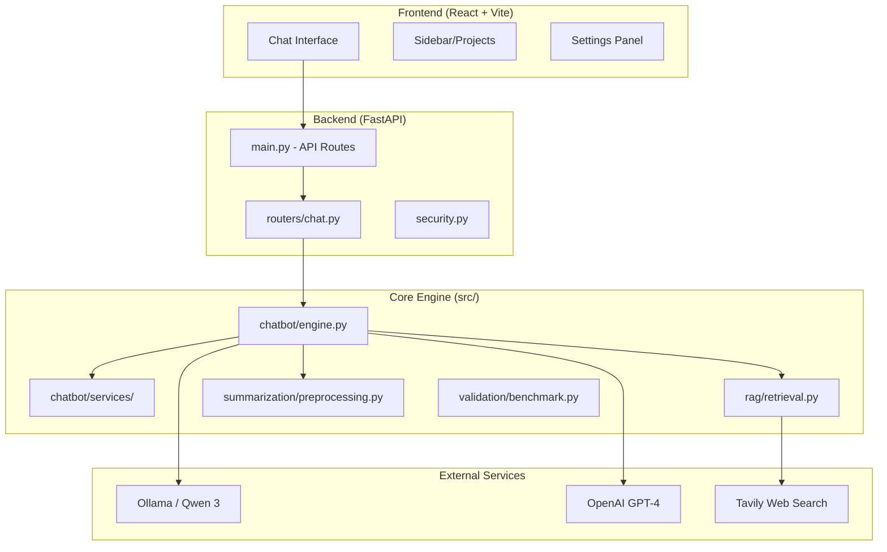
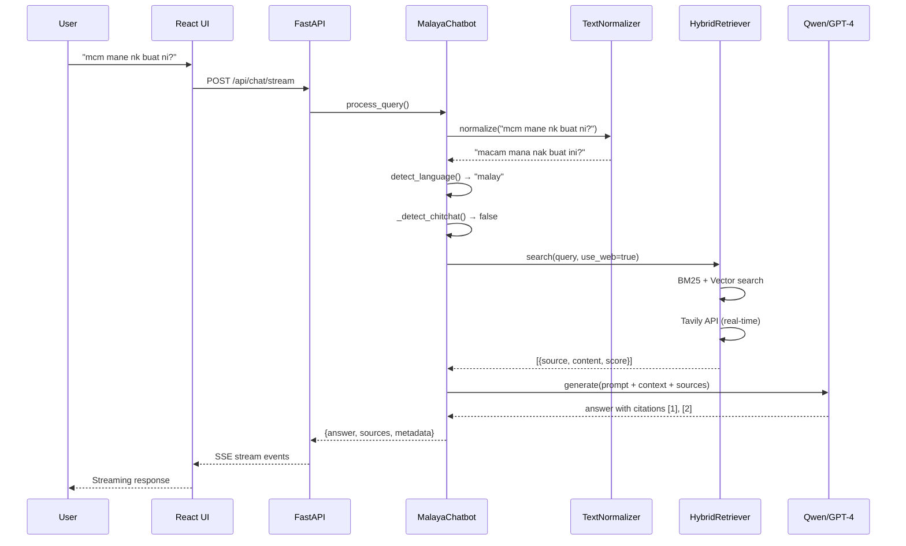
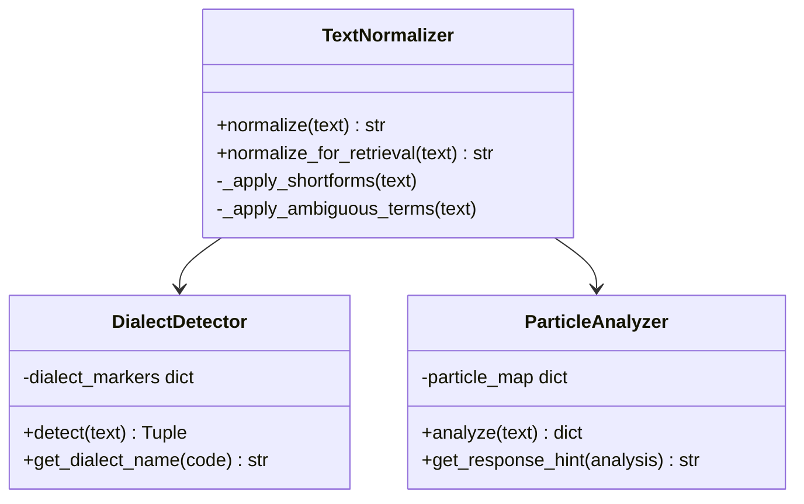
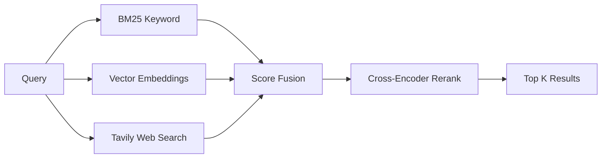

# Malaya LLM - Code Architecture Overview

> **Purpose**: Quick reference for understanding the codebase during demos or interviews. Use this to explain how different parts of the system work together.

---

## 🗺️ High-Level System Architecture



---

## 📁 Folder Structure Explained

```
Malaya LLM/
├── 📂 backend/                 # FastAPI REST API
│   ├── main.py                # Entry point - all endpoints + middleware
│   ├── routers/
│   │   └── chat.py            # Core /api/chat endpoints
│   ├── security.py            # API key validation, rate limiting
│   └── observability.py       # Prometheus metrics, logging
│
├── 📂 frontend/               # React UI (Claude/ChatGPT-style)
│   ├── src/
│   │   ├── App.jsx           # Main app shell
│   │   ├── components/
│   │   │   ├── ChatInterface.jsx    # Chat UI + streaming
│   │   │   ├── Sidebar.jsx          # Conversations, projects
│   │   │   └── ...
│   │   └── store/            # Zustand state management
│   └── vite.config.js        # Build config
│
├── 📂 src/                    # Core Python Logic
│   ├── 📂 chatbot/           # Engine, services, DSPy optimizer
│   ├── 📂 rag/               # Retrieval (BM25 + Vector + Web)
│   ├── 📂 summarization/     # Text normalization & dialect handling
│   ├── 📂 validation/        # Benchmark suite & test cases
│   ├── 📂 data/              # Static data (shortforms.json)
│   ├── 📂 deployment/            # 🐳 Docker & Shell scripts
│   ├── Dockerfile
│   ├── deploy.sh
│   └── run.sh
│   ├── 📂 scripts/               # Utility scripts
│   ├── 📂 debug/             # Tests & one-off scripts
│   ├── benchmark_*.py        # Performance benchmarks
│   ├── run_*_tests.sh        # Test runners
│   └── validate_shortforms.py
│
├── 📂 notebooks/             # 📓 Jupyter Notebooks
│   └── Malaya_LLM_Finetune.ipynb
│
├── 📂 benchmark-tracker/     # Benchmark visualization app
│   ├── 📂 logs/              # 📝 Benchmark execution logs
│   ├── server.py             # Backend for visualizer
│   └── index.html            # Frontend for visualizer
│
├── 📂 tests/                 # Test suites
│   ├── north_star_eval.py    # Main integration tests
│   └── model_comparison.py   # LLM comparison tests
│
├── 📂 reports/               # Generated reports
│   ├── 📂 validation/        # Results (JSON/CSV) form runs
│   ├── benchmark_report.md   # Latest benchmark results
│   └── benchmark_viz.png     # Visualization chart
│
├── 📂 docs/                  # Documentation
│   ├── 📂 frontend/          # UI/UX docs
│   ├── 📂 backend/           # API & Server docs
│   │   ├── dialects.md       # Dialect catalog
│   │   └── production_grade.md # Production checklist
│   ├── 📂 reports/           # Analysis & Comparisons (e.g., gptvsqwen)
│   └── 📂 private/           # 🔒 Personal notes, keys (gitignored)
│
├── config.yaml               # ⭐ System prompts & settings
└── README.md                 # Project overview
```

### 🔒 Security & Privacy
- **Private Documentation**: Personal notes, interview prep, and sensitive keys are stored in `docs/private/`. This folder is **gitignored** and will never be pushed to GitHub.
- **Secrets Management**: `.env` files and certificates (`*.pem`, `*.key`) are strictly ignored.
- **Data Sovereignty**: All RAG and vector data resides locally; no customer data leaves the environment.
- **Logs & Data**: Training data (`data/training/`) and logs (`benchmark-tracker/logs/`) are also excluded from git.
- **Deployment**: containerization scripts are isolated in `deployment/`.

---

## 🔄 Data Flow Diagram

This shows how a user query flows through the system:



---

## 🧠 Core Components Deep Dive

### 1. `engine.py` - The Brain

The **`MalayaChatbot`** class is the heart of the system.

| Method | Purpose |
|:-------|:--------|
| `__init__` | Loads config, initializes normalizer, sets up LLM |
| `process_query()` | Main entry point - orchestrates the full pipeline |
| `_detect_language()` | Classifies input as malay/english/manglish |
| `_get_project_memory()` | Retrieves long-term memory for the project |
| `_build_context()` | Formats search results for LLM context |
| `_condense_question()` | Rewrites follow-ups into standalone questions |

**Key Features in `process_query()`:**
1. Text normalization (Manglish → Malay)
2. Language detection
3. Chitchat detection (skip search for greetings)
4. Tool calling (web search, maps, image analysis)
5. Citation injection
6. Language mirroring (reply in user's language)

---

### 2. `preprocessing.py` - Malaysian NLP

Three key classes for understanding Malaysian text:



**Example Transformations:**
| Input | Normalized |
|:------|:-----------|
| `xleh la bro` | `tak boleh lah bro` |
| `mcm mane` | `macam mana` |
| `xde duit` | `tiada duit` |
| `best gila siot` | `sangat best` |

---

### 3. `retrieval.py` - Hybrid Search

The **`HybridRetriever`** combines multiple search strategies:



**Key Features:**
- **BM25**: Fast keyword matching using Okapi BM25
- **Vector**: Semantic similarity (sentence-transformers)
- **Web**: Real-time results via Tavily API
- **Domain Filtering**: Blocks Reddit, Quora; boosts .gov.my, .edu.my
- **Freshness Scoring**: Recent content gets priority

---

### 4. `benchmark.py` - Evaluation Suite

The **`MalaysianBenchmark`** tests 7 categories:

| Category | What It Tests |
|:---------|:--------------|
| **Shortforms** | `xleh` → `tak boleh` |
| **Dialects** | Kelantan, Terengganu, Kedah detection |
| **Particles** | `lah`, `meh`, `kot` sentiment |
| **Sentiment** | Malaysian sarcasm & emotion |
| **Cultural** | Raya, CNY, local references |
| **Code-switching** | Malay-English mixing |
| **Ambiguous** | Context-aware slang expansion |

---

## 🎛️ Configuration (`config.yaml`)

Key sections in the config file:

```yaml
model:
  provider: ollama  # or "openai"
  name: qwen3:14b   # or "gpt-4o"
  temperature: 0.7

system_prompt: |
  You are a Malaysian AI assistant...
  
rate_limits:
  requests_per_minute: 60
  requests_per_day: 1000

features:
  web_search: true
  citations: true
  memory: true
```

---

## 🧪 Testing Hierarchy

```
Fast Tests (10s)
├── Schema validation
└── Unit tests

Regression Tests (30s)
├── Benchmark suite
└── Integration tests

Deep Tests (2min)
├── Full benchmarks
├── E2E tests
└── Model comparisons
```

**Run Commands:**
```bash
./scripts/run_fast_tests.sh      # Quick schema + unit
./scripts/run_regression_tests.sh # Benchmark + integration
./scripts/run_deep_tests.sh      # Full E2E suite
```

---

## 📊 Interview Quick Reference

### "How does it understand Manglish?"
> The **TextNormalizer** in `preprocessing.py` expands 400+ Malaysian shortforms before sending to the LLM. Example: `xleh` → `tak boleh`.

### "How does search work?"
> **HybridRetriever** in `retrieval.py` combines BM25 (keywords), vector embeddings (semantics), and Tavily (real-time web) with score fusion.

### "What's the architecture?"
> React frontend → FastAPI backend → MalayaChatbot engine → Ollama/OpenAI. The engine orchestrates normalization, search, and generation.

### "How do you ensure quality?"
> The **MalaysianBenchmark** tests 7 categories: shortforms, dialects, particles, sentiment, cultural, code-switching, and ambiguous terms. CI runs these on every commit.

### "What makes it 'Sovereign AI'?"
> It can run entirely on local infrastructure: Ollama for LLM, ChromaDB for vectors, no data leaves the premise. The `.gov.my` priority shows Malaysia-first design.

---

## 🔗 Key Files to Reference

| File | When to Open |
|:-----|:-------------|
| [engine.py](../src/chatbot/engine.py) | Explain main logic |
| [preprocessing.py](../src/summarization/preprocessing.py) | Explain Manglish handling |
| [retrieval.py](../src/rag/retrieval.py) | Explain search system |
| [benchmark.py](../src/validation/benchmark.py) | Show quality metrics |
| [config.yaml](../config.yaml) | Show configurability |
| [shortforms.json](../src/data/shortforms.json) | Show slang dictionary |

---

*Last updated: January 2026*
